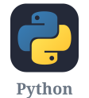
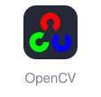
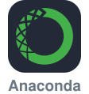
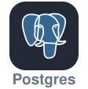
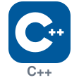
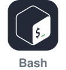

<!--  -->

<h1 align="center"> 
  <a href="https://git.io/typing-svg"></a>
  <br />
  <div style="text-align: center;">
    <a href="https://brady0127.github.io"></a>
    <a href="https://www.linkedin.com/in/bin-zhang-304171293/"></a>
    <a href="https://www.youtube.com/@binzhang0127"></a>
    <a href="https://x.com/REPLACE_ME"></a>
    
  </div>
</h1>

<div align="center">

</div>

<h2>About Me </h2>

```txt
Mostly thinking, sometimes coding, always staying upbeat.
```

  <h4> - 🎓 &nbsp; Master student in Information Studies at McGill University </h4>
  <h4> - 🛫 &nbsp; Exchange student at the University of Glasgow in 2023-2024 </h4>
  <h4> - 📖 &nbsp; Learning various aspects of Computer Science, especially Data Science and Business Analysis </h4>
  <h4> - 🤔 &nbsp; I am open to new opportunities :) </h4>


<!-- Recent Projects — 内容待补充

<h2>Recent Projects</h2>

  <h4> - 🔬 &nbsp; <a href="https://github.com/brady0127/ACORN_Redesign">ACORN_Redesign</a> &nbsp;·&nbsp; <code>C++</code> &nbsp; Efficient arbitrary-filtering approximate nearest-neighbour search, built on ACORN </h4>
  <h4> - 🎥 &nbsp; <a href="https://github.com/brady0127/UNNC-CV-Coursework">UNNC-CV-Coursework</a> &nbsp;·&nbsp; <code>Python</code> &nbsp; Multi-person detection and tracking with YOLOv5 and DeepSORT, served through Streamlit </h4>
  <h4> - 🌐 &nbsp; <a href="https://brady0127.github.io">brady0127.github.io</a> &nbsp;·&nbsp; <code>HTML</code> &nbsp; Personal page — notes, background and longer writing </h4>


-->

<h2>Tech Stack </h2>

<table>
  <tr>
    <td colspan="3" align="center" width="37.5%">
      
    </td>
    <td align="center" width="12.5%">
      
    </td>
    <td align="center" width="12.5%">
      
    </td>
    <td align="center" width="12.5%">
      
    </td>
    <td align="center" width="12.5%">
      
    </td>
    <td align="center" width="12.5%">
      
    </td>
  </tr>
  <tr>
    <td align="center" width="12.5%">
      
    </td>
    <td align="center" width="12.5%">
      
    </td>
    <td align="center" width="12.5%">
      
    </td>
    <td align="center" width="12.5%">
      
    </td>
    <td align="center" width="12.5%">
      
    </td>
    <td align="center" width="12.5%">
      
    </td>
    <td align="center" width="12.5%">
      
    </td>
    <td align="center" width="12.5%">
      
    </td>
  </tr>
  <tr>
    <td align="center" width="12.5%">
      
    </td>
    <td align="center" width="12.5%">
      
    </td>
    <td align="center" width="12.5%">
      
    </td>
    <td align="center" width="12.5%">
      
    </td>
    <td align="center" width="12.5%">
      
    </td>
    <td align="center" width="12.5%">
      
    </td>
    <td align="center" width="12.5%">
      
    </td>
    <td align="center" width="12.5%">
      
    </td>
  </tr>
</table>


<div align="center">

</div>

<!-- <p> &nbsp;</p>


 -->

<!-- <p> &nbsp;</p>


<p> &nbsp;</p>
 -->


<!--
**brady0127/brady0127** is a ✨ _special_ ✨ repository because its `README.md` (this file) appears on your GitHub profile.

Here are some ideas to get you started:

- 🔭 I’m currently working on ...
- 🌱 I’m currently learning ...
- 👯 I’m looking to collaborate on ...
- 🤔 I’m looking for help with ...
- 💬 Ask me about ...
- 📫 How to reach me: ...
- 😄 Pronouns: ...
- ⚡ Fun fact: ...
-->
